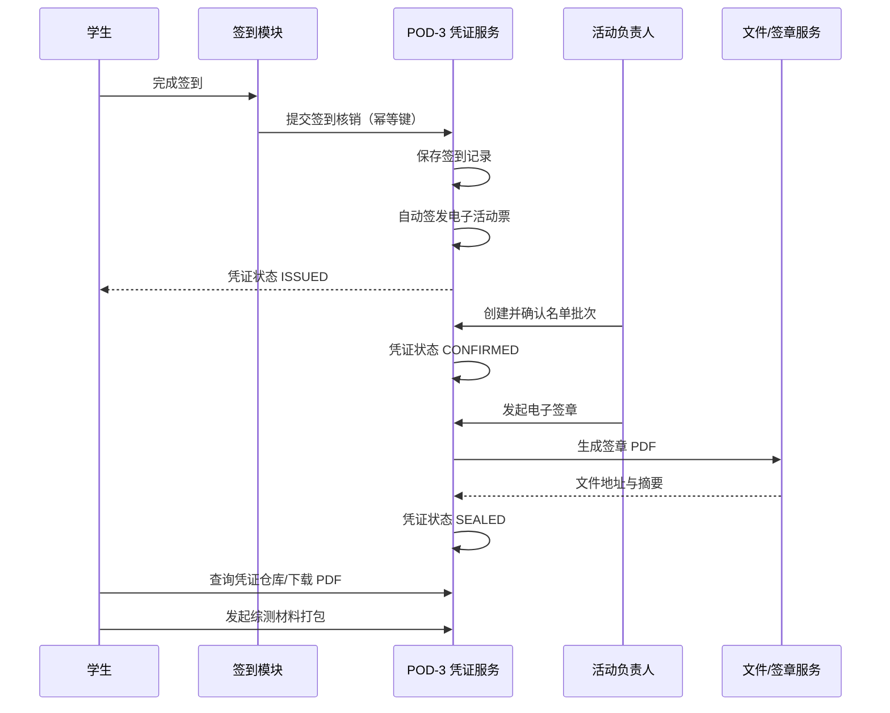

# POD-3 凭证管理第一周规格说明 v1.0

## 1. 目标与范围

POD-3 负责把学生的有效签到转换为可核验、可签章、可下载、可用于综测申报的电子凭证。

本期范围：

1. 签到成功后自动生成电子活动票。
2. 负责人查看签到名单并按批次确认。
3. 对已确认名单执行电子签章。
4. 学生集中查看、预览和下载个人凭证 PDF。
5. 学生一键打包导出综测材料。
6. 负责人批量导出活动加分名单。
7. 对关键操作留存审计记录。

第一周不实现：真实 CA 签章、真实对象存储上传、复杂防伪二维码、学院审批流、综测系统自动提交。这些能力先保留接口扩展点。

## 2. 参与角色与权限

### 学生 `STUDENT`

- 查看自己的凭证仓库和凭证详情。
- 下载自己的已签章凭证。
- 发起自己的综测材料打包任务。
- 不得查看或导出其他学生的数据。

### 活动负责人 `ORGANIZER`

- 查看本人负责活动的签到名单。
- 创建名单确认批次并提交确认结果。
- 使用有权限的电子印章签章。
- 导出本人负责活动的加分名单。

### 系统管理员 `ADMIN`

- 查询全部凭证、批次和导出任务。
- 撤销错误凭证并记录原因。
- 审计签章、下载和导出操作。

## 3. 业务主流程



## 4. 状态机

### 签到记录

- `SUCCESS`：签到有效，可签发凭证。
- `CANCELLED`：签到被撤销；关联凭证应被管理员撤销。

同一活动、同一学生最多存在一条有效签到。

### 电子凭证

```text
ISSUED -> CONFIRMED -> SEALED
   |          |           |
   +----------+-----------+-> REVOKED
```

- `ISSUED`：签到成功后自动签发，尚未经过负责人确认。
- `CONFIRMED`：已被负责人纳入确认名单。
- `SEALED`：签章完成，PDF 可下载并用于综测材料。
- `REVOKED`：管理员撤销，不得继续下载或参与导出。

不允许跳过 `CONFIRMED` 直接签章。

### 名单确认批次

- `DRAFT`：批次已创建，可调整名单。
- `CONFIRMED`：负责人确认完成，名单冻结。
- `SEALED`：整批签章完成。
- `CANCELLED`：批次取消。

### 导出任务

- `PENDING -> PROCESSING -> SUCCEEDED | FAILED`
- 下载地址必须设置过期时间。

## 5. 关键业务规则

1. 签到接口必须携带 `Idempotency-Key`，重复请求返回同一签到记录和凭证，不重复发票。
2. 只有 `SUCCESS` 的签到才能生成凭证。
3. 凭证编号全局唯一，格式建议为 `ET-YYYYMMDD-随机段`。
4. 名单确认时，所有凭证必须属于同一活动且状态为 `ISSUED`。
5. 签章前批次必须处于 `CONFIRMED`。
6. 签章后的 PDF 需要保存 SHA-256 摘要；下载时可用于完整性校验。
7. 学生综测材料默认只包含 `SEALED` 凭证。
8. 负责人加分名单只允许导出自己管理的活动。
9. 撤销凭证必须填写原因，并写入审计日志。
10. 原始学生隐私信息不进入 POD-3；导出名单只返回业务所需的最小字段。

## 6. API 约定

- 规范文件：`api/pod3-openapi.yaml`
- 日期时间：ISO 8601 UTC，例如 `2026-10-13T08:00:00Z`。
- 认证：`Authorization: Bearer <JWT>`。
- 幂等：创建签到和导出任务时传 `Idempotency-Key`。
- 分页：`page_token` + `page_size`，避免页码翻页时数据漂移。
- 错误响应：统一包含 `code`、`message`、`request_id` 和可选 `details`。

建议错误码：

- `VALIDATION_ERROR`
- `UNAUTHORIZED`
- `FORBIDDEN`
- `RESOURCE_NOT_FOUND`
- `DUPLICATE_CHECKIN`
- `INVALID_STATE_TRANSITION`
- `CREDENTIAL_ACTIVITY_MISMATCH`
- `SEAL_PERMISSION_DENIED`
- `EXPORT_FAILED`

## 7. 数据模型

数据库定义见 `db/pod3-schema.sql`。

核心实体：

- `checkin_record`：签到事实与幂等信息。
- `credential`：电子活动票及其状态、PDF、摘要。
- `confirmation_batch`：负责人名单确认批次。
- `confirmation_item`：批次中的凭证与确认结论。
- `seal_record`：签章证据与文件摘要。
- `export_job`：学生材料包或负责人名单导出任务。
- `audit_log`：关键操作审计记录。

## 8. 与其他模块的联调边界

### 上游依赖

- 活动模块：`activity_id`、活动标题、举办组织、综测分值、负责人权限。
- 用户模块：`student_id`、展示名、学号；POD-3 不复制敏感画像数据。
- 签到模块：签到成功事件或同步 API 调用。
- 权限模块：JWT 中的 `sub`、`roles`、`organization_ids`。

### 下游依赖

- 签章服务：输入 PDF/名单与 `seal_id`，返回签章文件地址、时间和摘要。
- 文件服务：凭证 PDF 和 ZIP 的对象存储、临时下载链接。
- 消息模块：凭证签发、签章完成、导出完成通知。

### 建议事件

- `checkin.succeeded`
- `credential.issued`
- `confirmation_batch.confirmed`
- `credential.sealed`
- `credential.revoked`
- `export.succeeded`

事件至少包含 `event_id`、`event_type`、`occurred_at`、`aggregate_id`、`payload_version`。

## 9. 第一周验收场景

### 场景 A：签到自动发票

给定学生尚未在活动中签到，当签到成功请求携带新幂等键时：

- 返回 HTTP 201。
- 创建一条有效签到记录。
- 自动创建一张状态为 `ISSUED` 的电子活动票。
- 重放同一幂等键返回同一结果，不产生重复数据。

### 场景 B：名单确认与签章

给定活动存在 `ISSUED` 凭证，当负责人创建确认批次并签章时：

- 批次由 `DRAFT` 进入 `CONFIRMED`，签章后进入 `SEALED`。
- 批次内凭证由 `ISSUED` 进入 `CONFIRMED`，签章后进入 `SEALED`。
- 保存签章文件地址和 SHA-256 摘要。

### 场景 C：学生凭证仓库

- 学生只能看到自己的凭证。
- 已签章凭证可以获取 PDF 下载信息。
- 已撤销凭证不可下载、不可进入综测导出包。

### 场景 D：导出

- 学生可以创建个人综测材料导出任务。
- 负责人可以创建活动加分名单导出任务。
- 导出任务可查询状态，成功后返回带过期时间的下载地址。

## 10. 主要风险与处理

- 接口对不齐导致联调延期：第一周冻结 OpenAPI v1.0；变更必须记录版本和影响。
- 代码/数据丢失：主仓库启用分支保护；数据库每日备份；导出文件可重建。
- 学生隐私泄露：最小化字段、对象存储临时链接、审计下载与导出。
- 成员进度拖延：两人按“签到/凭证”和“签章/导出”拆分，接口互审。
- 范围蔓延：第一周只完成契约、schema、Mock 和测试，不提前实现学院审批流。

## 11. 两人建议分工

### 成员 A：签到与凭证仓库

- 签到核销、幂等处理、自动发票。
- 凭证查询、详情和下载权限。
- `checkin_record`、`credential` 表评审。

### 成员 B：名单签章与导出

- 确认批次、电子签章适配接口。
- 学生材料包与负责人加分名单导出。
- `confirmation_*`、`seal_record`、`export_job` 表评审。

两人共同完成 OpenAPI 评审、异常码统一和冒烟测试。

